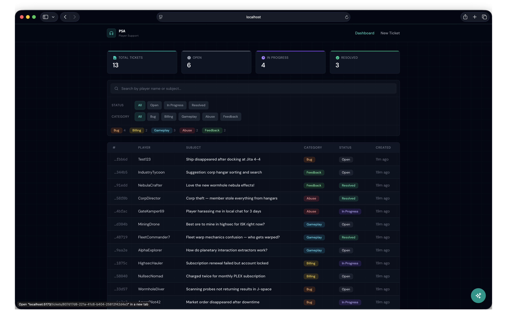
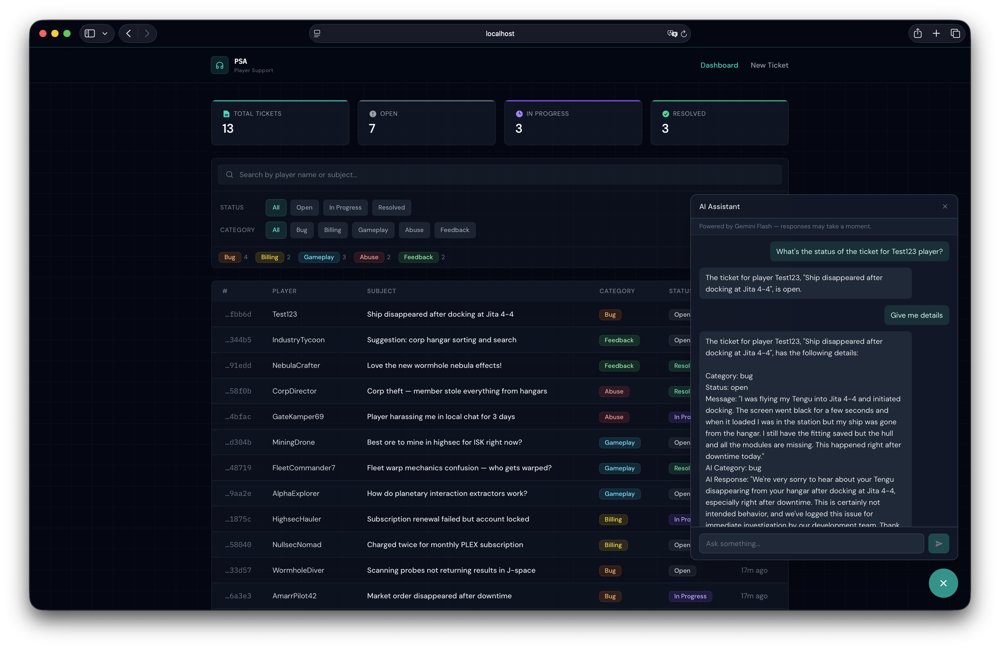
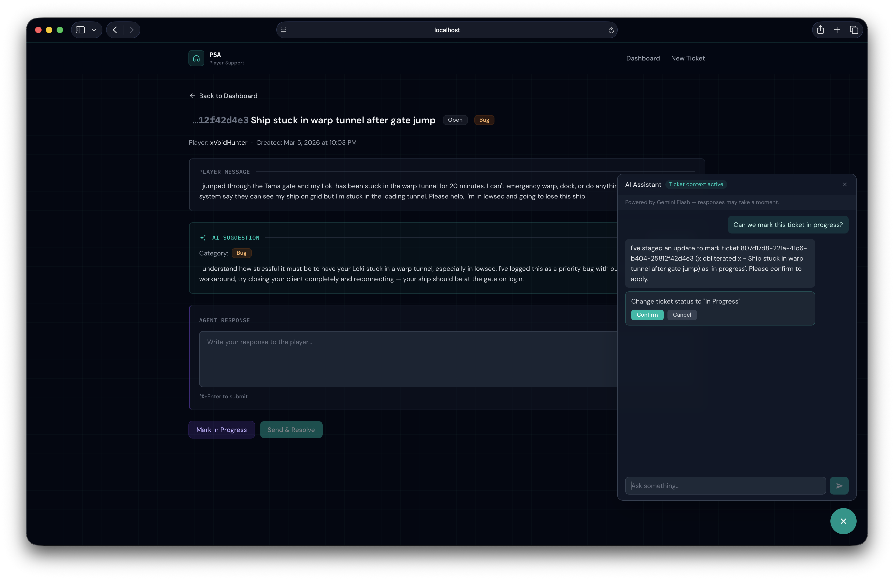
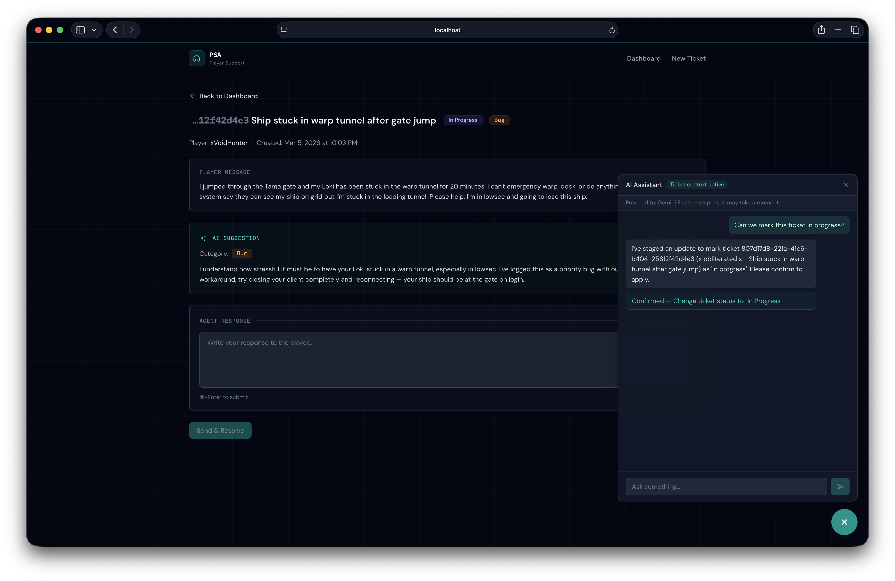

# Player Support Assistant

Built as a showcase project for a CCP Games Tools Programmer application.

A game support tool that uses AI to automatically categorize player tickets,
suggest responses, and provide an interactive chat assistant for support agents.
Demonstrates full-stack development, DevOps practices, and AI integration.

**[Live Demo](https://psa-5a24.onrender.com)**
> First load may take ~30 seconds if the service is cold (free tier).

## What It Does

Players submit support tickets. The AI automatically categorizes them
(bug, billing, gameplay, abuse, feedback) and generates a suggested response.
Support agents review the suggestion, edit if needed, and resolve the ticket.

## AI Features

Both features are powered by **Google Gemini 2.5 Flash** via the Gemini API.

### Ticket Auto-Categorization

When a new ticket is submitted, the AI automatically:
- **Categorizes** the ticket into one of five categories: bug, billing, gameplay, abuse, or feedback
- **Suggests a response** with a professional, game-aware tone referencing in-game concepts (ships, ISK, PLEX, corporations, etc.)

The agent can override the category and edit the suggested response before resolving.
If the API key is missing or the service is down, tickets are still created — just without AI suggestions.

### AI Chat Assistant

A floating chat widget (bottom-right corner) gives agents an interactive AI assistant that can:

- **Search tickets** by text, status, or category
- **Look up ticket details** by ID
- **Propose actions** like changing ticket status, updating categories, or resolving tickets with a response

The assistant uses **tool-calling** — it decides which tools to invoke based on the conversation, executes read operations (search, lookup) server-side, and returns write operations (status changes, resolves) as proposals that require agent confirmation before executing. The chat is context-aware: when viewing a specific ticket, the assistant automatically has that ticket's details.

## Screenshots

### Dashboard


### AI Chat Assistant — Ticket Lookup


### AI Chat Assistant — Action Confirmation


### AI Chat Assistant — Action Confirmed


## Tech Stack

- **Backend:** Django REST Framework + PostgreSQL
- **Frontend:** React + Vite + Tailwind CSS
- **AI:** Google Gemini 2.5 Flash
- **DevOps:** Docker, GitHub Actions CI/CD, deployed to Render.com

## Run Locally

### With Docker (recommended)

```bash
git clone git@github.com:milosptr/player-support-assistant-demo.git
cd player-support-assistant-demo
cp .env.example .env
# Add your GEMINI_API_KEY to .env (get one free at https://aistudio.google.com/apikey)
docker-compose up --build
```

Visit http://localhost:8000 — the dashboard loads with pre-seeded tickets.

### Without Docker

Requires Python 3.12+ and Node 20+.

```bash
# Backend (uses SQLite by default — no Postgres needed locally)
python -m venv .venv && source .venv/bin/activate
pip install -r backend/requirements.txt
cd backend
python manage.py migrate
python manage.py seed_tickets
python manage.py runserver

# Frontend (separate terminal)
cd frontend
npm install
npm run dev
```

Visit http://localhost:5173 (Vite proxies API calls to Django).

## Environment Variables

| Variable | Required | Description |
|----------|----------|-------------|
| `DJANGO_SECRET_KEY` | Yes (prod) | Django secret key |
| `DATABASE_URL` | Yes (prod) | PostgreSQL connection URL |
| `GEMINI_API_KEY` | No | Enables AI categorization and chat assistant ([get a free key](https://aistudio.google.com/apikey)) |

## Project Structure

```
psa/
├── backend/          # Django REST API
│   ├── psa/          # Project config
│   └── tickets/      # Main app (model, API, AI service, chat service)
├── frontend/         # React + Vite + Tailwind
│   └── src/
├── Dockerfile        # Multi-stage production build
├── docker-compose.yml
└── .github/workflows/ci.yml
```
